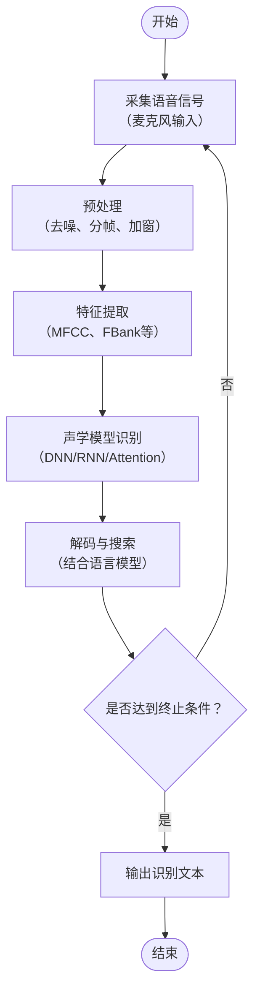

```mermaid
flowchart TD
    A([开始]) --> B[采集语音信号<br>（麦克风输入）]
    B --> C[预处理<br>（去噪、分帧、加窗）]
    C --> D[特征提取<br>（MFCC、FBank等）]
    D --> E[声学模型识别<br>（DNN/RNN/Attention）]
    E --> F[解码与搜索<br>（结合语言模型）]
    F --> G{是否达到终止条件？}
    G -->|否| B
    G -->|是| H[输出识别文本]
    H --> I([结束])
```